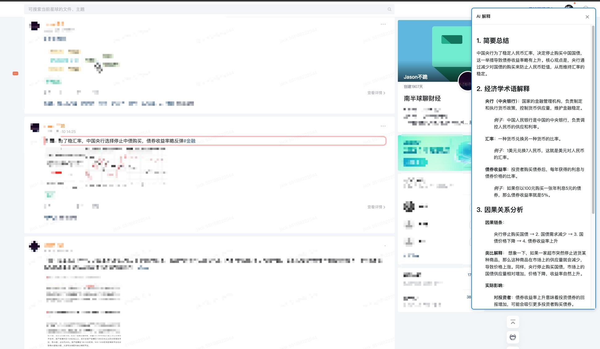

# ZSXQ-AI-Explainer

【南半球聊财经】知识星球 AI 解释器 - 一个帮助理解知识星球内容的浏览器扩展

## 功能特点

- 🤖 基于 DeepSeek AI 提供智能解析
- 💡 经济学专业视角的内容分析
- 🔍 右键快捷操作，便捷实用

## 使用方法

1. 安装扩展后，点击扩展图标配置 DeepSeek API Key：
   1. 如何获取 API Key？进入 [DeepSeek AI](https://www.deepseek.com/) 官网，点击"接入 API"
   2. 在 API Keys 页面创建新的 API Key
   3. 注：充值 10 元即可使用较长时间，无任何广告成分，放心食用
2. 在知识星球页面内容区域右键唤起菜单（部分浏览器如 Chrome 需要"双击右键"）
3. 点击"解释内容"选项
4. 等待 AI 分析结果在右侧弹窗中显示

## 安装方法

1. 下载项目代码
2. 打开 Chrome 扩展管理页面 (chrome://extensions/)
3. 开启"开发者模式"
4. 点击"加载已解压的扩展程序"
5. 选择项目文件夹
6. 更新插件：确保对应文件夹文件已替换更新到最新，点击插件右下角"更新"或者"重新加载"按钮

## 配置说明

1. 点击扩展图标打开配置面板
2. 输入您的 DeepSeek API Key
3. 点击保存即可使用

## 规划

- [x] 自定义提示词
- [ ] 更多模型
- [ ] 同步到笔记软件

## 其他说明

由于版权限制，本插件不支持复制原有文字，不提供相关功能。弹窗内仅支持对内容进行解释，不会展示原文。

## 许可证

MIT

## 贡献指南

欢迎提交 Issue 和 Pull Request 来帮助改进项目。
