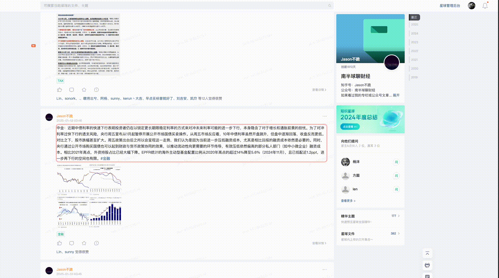
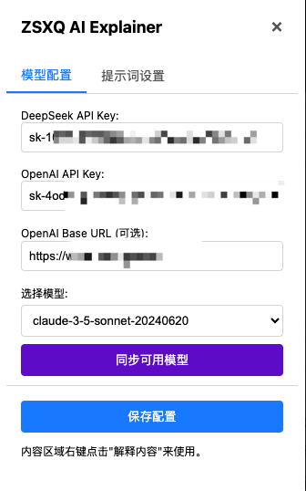
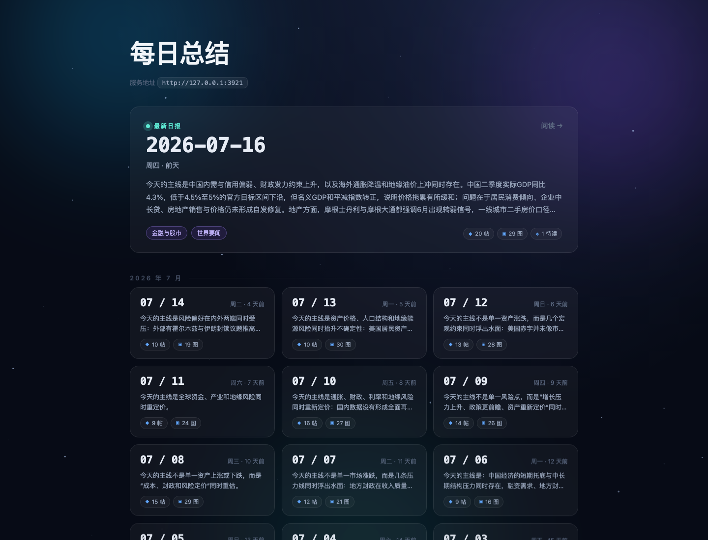
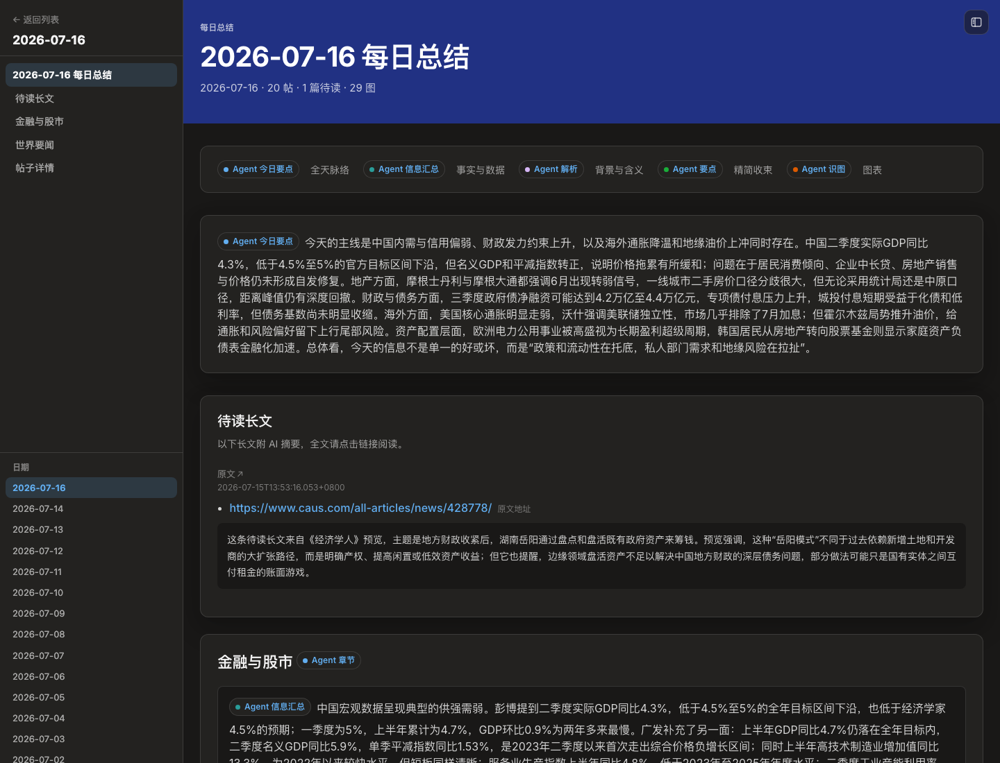

# ZSXQ-AI-Explainer

【南半球聊财经】知识星球 AI 解释器 - 一个帮助理解知识星球内容的浏览器扩展



## 设置界面



## 功能特点

- 🤖 基于大模型提供智能解析
- 💡 经济学专业视角的内容分析
- 🔍 右键快捷操作，便捷实用
- 📰 每日总结流水线：一键导出星球帖子，AI 生成结构化日报（含图表识别、长文摘要）
- 📚 待读长文自动抓取全文并生成 AI 摘要，日报页面直接阅读要点
- 🗂 本地日报站点：极光风格日期首页 + Notion 深色报告页，支持目录折叠与日期切换
- 🏷️ 多来源内容以独立「原文」标记呈现，便于回到对应帖子或长文

## 每日总结（Daily Pipeline）

除右键解释外，本项目内置一条本地日报流水线：扩展导出星球帖子 → OCR/识图 → AI 总结 → 生成 HTML 日报，全程在本机完成。

### 页面效果

首页（`http://127.0.0.1:3921/`）：置顶最新日报，并以月份卡片展示每日摘要、主题标签、帖子数、图片数和待读数。



日报页面采用 Notion 风格深色布局：左侧整合章节目录与日期切换，右上角可折叠目录；正文按 Agent 生成环节标记信息层次，「待读长文」区块自动附全文 AI 摘要。



### 前置依赖

| 依赖 | 用途 |
|------|------|
| Node.js 22.13+ | 运行全部 `scripts/*.mjs` 脚本；Cursor SDK 要求此版本 |
| Chrome 扩展（本项目，>= 0.9.8） | 导出帖子/图片；抓取 `articles.zsxq.com` 长文全文（需登录知识星球） |
| [Cursor Agent SDK](https://cursor.com/docs/sdk/typescript) (`@cursor/sdk`) | AI 总结与图表识别；需 `CURSOR_API_KEY`（Dashboard → API Keys） |

Agent 模型可通过环境变量覆盖：

- `CURSOR_API_KEY`：Cursor API key（必填）。写入 gitignore 的 `scripts/.env`，或导出为环境变量；不复用 `agent login`
- `CURSOR_SUMMARY_MODEL`：总结 agent，默认 `grok-4.5`
- `CURSOR_VISION_MODEL`：识图 agent，默认 `composer-2.5`
- `CURSOR_AGENT_MAX_RETRIES` / `CURSOR_AGENT_RETRY_DELAY_MS`：SDK 判定可重试（含瞬时网络）时的重试次数（默认 2）与首次重试延迟（默认 5000ms，按次数递增）

### 快速开始

```bash
# 1. 启动本地 inbox 服务（接收扩展导出、提供日报站点、每日 13:00 定时任务）
node scripts/local-inbox-server.mjs

# 2. Chrome 加载扩展并打开 wx.zsxq.com（扩展会自动通过 WebSocket 连上服务）

# 3. 触发导出 + 跑全流程（也可以等定时任务自动跑）
node scripts/trigger-export.mjs
node scripts/build-daily-pipeline.mjs

# 4. 浏览器打开 http://127.0.0.1:3921/ 查看日报
```

### 核心脚本

| 脚本 | 作用 |
|------|------|
| `scripts/local-inbox-server.mjs` | 常驻服务：接收扩展导出（`POST /inbox/daily`）、日报站点（`/view/{date}`，含侧边栏日期切换）、扩展 WebSocket 桥、每日定时导出+总结 |
| `scripts/trigger-export.mjs` | 让扩展执行一次增量导出（从上次 checkpoint 之后） |
| `scripts/build-daily-pipeline.mjs --date 2026-07-04` | 对指定日期跑完整流水线：OCR → 识图 agent → 总结 agent → HTML；可用 `--skip-ocr` `--skip-vision` `--skip-summary` `--skip-html` 跳过步骤 |
| `scripts/backfill-summaries.mjs --since 2026-07-04` | 补总结：从指定日期起重新导出（按日分桶），并对每一天跑完整流水线 |
| `scripts/run-summary-agent.mjs --date 2026-07-04` | 单独重跑 AI 总结（生成 `summary-input.json` 并调用 agent 写 `summary.json`） |
| `scripts/build-daily-summary.mjs --date 2026-07-04` | 单独重渲染 HTML（`summaries/{date}.html` + `daily-inbox/{date}/report.html`） |
| `scripts/enrich-manifest-images.mjs` | 本地 OCR，标注图片类型（text/chart/photo） |
| `scripts/run-vision-agent.mjs` | 识图 agent：为图表生成 `chart_summary` |

### 待读长文摘要

星球「预览 + 全文链接」帖（`post_kind=article_link`）的处理方式：

1. 导出时扩展经 background 抓取 `articles.zsxq.com` 全文（带登录 cookie），写入 manifest 的 `article_content`
2. 总结 agent 基于全文生成 3–5 句摘要，写入 `summary.json` 顶层 `reading_list[]`（长文不进入正文章节）
3. 日报「待读长文」区块展示摘要 + 原文链接；抓取失败时回退为基于预览的 1–2 句提要

数据流与更多细节见 [docs/DAILY-PIPELINE.md](docs/DAILY-PIPELINE.md)。

## 使用方法

1. 安装扩展后，点击扩展图标配置 DeepSeek API Key：
   1. 如何获取 API Key？进入 [DeepSeek AI](https://www.deepseek.com/) 官网，点击右上角"开放平台"
   2. 在 API Keys 页面创建新的 API Key
   3. 注：充值 10 元即可使用较长时间，无任何广告成分，放心食用
2. 在知识星球页面内容区域右键唤起菜单（部分浏览器如 Chrome 需要"双击右键"）
3. 点击"解释内容"选项
4. 等待 AI 分析结果在右侧弹窗中显示

## 安装方法

1. 下载项目代码
2. 打开 Chrome 扩展管理页面 (chrome://extensions/)
3. 开启"开发者模式"
4. 点击"加载已解压的扩展程序"
5. 选择项目文件夹
6. 更新插件：确保对应文件夹文件已替换更新到最新，点击插件右下角"更新"或者"重新加载"按钮

## 配置说明

1. 点击扩展图标打开配置面板
2. 输入您的 DeepSeek API Key
3. 点击同步可用模型
4. 选择模型
5. 点击保存即可使用

## 规划

- [x] 自定义提示词
- [x] 更多模型 (可以使用国内的代理聚合服务商，以获取更多模型支持)
- [x] 每日总结流水线（导出 → OCR/识图 → AI 总结 → HTML 日报）
- [x] 待读长文全文抓取 + AI 摘要
- [ ] 同步到笔记软件（Logseq、Obsidian）

## 其他说明

由于版权限制，本插件不支持复制原有文字，不提供相关功能。弹窗内仅支持对内容进行解释，不会展示原文。

## 许可证

MIT

## 贡献指南

欢迎提交 Issue 和 Pull Request 来帮助改进项目。
