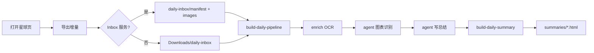

# 每日星球总结流水线（本地）

从知识星球抓取 → 本机 OCR → **Cursor Agent CLI** 识图/总结 → HTML 日报。

## 架构



## 一键运行（推荐）

扩展导出到 `daily-inbox/YYYY-MM-DD/` 后：

```bash
# 全流程：OCR → 图表 agent → 总结 agent → HTML
node scripts/build-daily-pipeline.mjs --date 2026-06-23

# 自动选 daily-inbox 里最新日期
node scripts/build-daily-pipeline.mjs
```

**前置条件**：本机已安装 Cursor CLI（`agent` 命令可用且已登录）。

## 分步运行

```bash
# 1. 启动 Inbox 桥接（推荐，同时代理 HTML 日报 + WebSocket）
node scripts/local-inbox-server.mjs
# 默认每天 13:00 自动跑完整链路（增量导出 → OCR → 总结 → HTML）
# 关闭定时：node scripts/local-inbox-server.mjs --no-schedule
# 改时间：  node scripts/local-inbox-server.mjs --schedule 09:30
# 浏览器打开 http://127.0.0.1:3921/latest（局域网可用本机 IP 访问）
# 扩展会自动连接 ws://127.0.0.1:3921/ws

# 2. 浏览器扩展 → 导出增量（或远程触发，见下）

# 3. OCR + 图表启发式分类
bash scripts/ocr/setup-pyenv.sh   # 首次
node scripts/enrich-manifest-images.mjs --date 2026-06-23

# 4. Cursor agent 图表摘要（分批读本地图片）
node scripts/run-vision-agent.mjs --date 2026-06-23

# 5. Cursor agent 写 summary.json
node scripts/run-summary-agent.mjs --date 2026-06-23

# 6. 拼 HTML
node scripts/build-daily-summary.mjs --date 2026-06-23
```

## 图片处理分工

| image_kind | 谁处理 | 总结用什么 | HTML |
|------------|--------|------------|------|
| `text` | PaddleOCR | `ocr_text` | 不嵌图 |
| `chart` | Cursor agent 看图 | `chart_summary` | 嵌图 + 说明 |
| `photo` | agent 判定 | 跳过 | 不嵌图 |

## 总结侧重点

Agent prompt 见 `scripts/prompts/daily-summary.md`：

- **金融与股市**：股市、宏观、黄金/白银等贵金属（合并为一节）
- **世界要闻**：地缘、央行、大宗商品
- 简洁易懂；chart 图进 HTML，text 截图只进文字

## 省 Token 策略

- manifest / summary-input 不含 base64
- OCR 本机 PaddleOCR
- agent 视觉阶段只打开 `needs_vision` 的本地 jpg
- 总结 agent 只读 `text`、`image_content`（截图文字）、`chart_summary`

## 扩展 ↔ 本机

| 方式 | 说明 |
|------|------|
| **本地 Inbox HTTP** | 扩展 POST → `local-inbox-server.mjs` 写仓库；同一服务代理 `summaries/*.html` 与图片 |
| **WebSocket 远程触发** | 扩展连接 `ws://{inbox}/ws`；CLI `node scripts/trigger-export.mjs` → `POST /export/trigger` → 刷新星球页并静默导出增量 |
| **Chrome Downloads** | Inbox 不可用时 fallback |

### 远程触发导出

```bash
# 需：inbox 服务运行 + 扩展已加载且连上 WebSocket
node scripts/trigger-export.mjs
node scripts/trigger-export.mjs --no-reload    # 不刷新页面，直接导出
node scripts/trigger-export.mjs --url http://192.168.1.10:3921

# 查看连接状态
curl http://127.0.0.1:3921/export/status
```

### 调试：精华区导出到自定义 inbox 文件夹

用于测试「预览 + 全文链接」等待读长文，或快速试跑总结流水线，**不写入日期文件夹**：

```bash
# 1. 启动 inbox 服务 + 重载扩展（0.9.8）
node scripts/local-inbox-server.mjs

# 2. 浏览器登录知识星球（可先手动切到「精华」）
node scripts/debug-export-digests.mjs --slug debug-digests --count 10

# 3. 一键跑 OCR → 总结 → HTML
node scripts/debug-export-digests.mjs --slug debug-digests --count 10 --pipeline

# 或分步（--slug 适用于所有 pipeline 脚本）
node scripts/build-daily-pipeline.mjs --slug debug-digests
```

输出目录：`daily-inbox/debug-digests/` · HTML：`summaries/debug-digests.html`

选项：`--no-reload`（不刷新页）、`--no-navigate`（不自动点「精华」）、`--count N`

导出后在本机终端运行 `node scripts/build-daily-pipeline.mjs` 即可。

### 补总结（漏抓 / 漏总结时回补）

当某天只导出未总结，或滚动漏抓了一段时间窗，用交互式补总结命令：重新导出指定起点之后的帖子 → 按发布日期拆成每日 manifest（与既有日期合并，不覆盖）→ 逐日跑 OCR→总结→HTML。

```bash
# 需：inbox 服务运行 + 扩展已加载（>= 0.9.7）且连上 WebSocket
node scripts/backfill-summaries.mjs
```

运行后交互二选一：

- **A**：从「最新已有总结」的最后一条事件继续（自动读取该日期 manifest 的 `checkpoint_after`）。
- **B**：强制从指定日期 00:00 开始（默认 `2026-06-27`，可输入修改）。

跳过交互直接指定起点：

```bash
node scripts/backfill-summaries.mjs --since 2026-06-27        # 从该日 00:00
node scripts/backfill-summaries.mjs --max-posts 300           # 调大单次上限（默认 200）
```

导出按帖子的**发布日期**写入对应 `daily-inbox/YYYY-MM-DD/`，每个被触及的日期都会重新生成 `summaries/YYYY-MM-DD.html`。

## 配置

`scripts/.env.example` — 可选 `CURSOR_AGENT_MODEL`、超时等。

## 重载扩展

`manifest.json` 当前 **0.9.8**，请在 `chrome://extensions` 重新加载。

**帖子类型**：`post_kind=article_link`（精华区「预览 + 全文链接」）会进入 HTML「待读长文」，不进入 sections/posts 总结。导出时扩展会经 background 抓取 `articles.zsxq.com` 长文全文（带登录 cookie），写入 manifest 的 `article_content`；summary agent 基于全文在 `summary.json` 顶层 `reading_list[]` 中生成 3–5 句摘要，HTML 在「待读长文」卡片中展示。无全文时回退为基于预览的 1–2 句提要。
